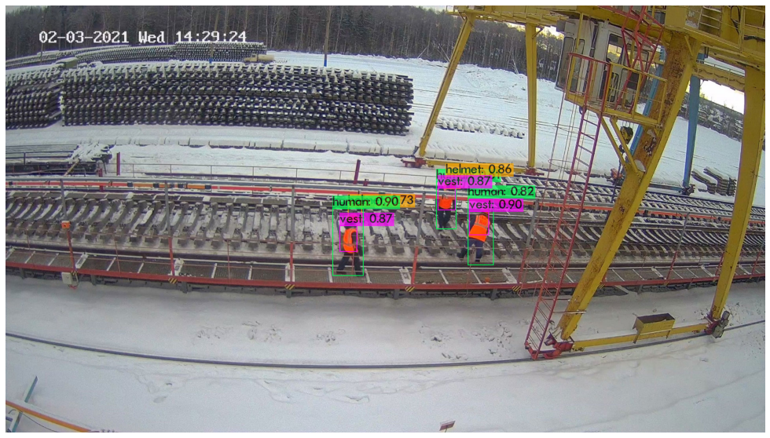

# Test task for `ICVR`

## Example of results

## Explanation

YOLOv4 was used as a model, fine-tuned for about an hour  

I don't have a GPU and so fine-tuning was done in Colab, the exact same *.ipynb* file used is located at */notebooks/training.ipynb* or you can look at it [here on Colab](https://colab.research.google.com/drive/1hW_fgQIEouo54TICSulDyHxa0kiAbXzX?usp=sharing)  

## How to use?

To inference this model you have to do a little setup:  

~~~bash
git clone https://github.com/EmpyEmpt/ttICVR.git
git clone https://github.com/AlexeyAB/darknet

cp -r ttICVR/yolo-files/* darknet/data
cp ttICVR/yolo-files/yolov4-custom.cfg darknet/cfg

cd darknet
sed -i 's/OPENCV=0/OPENCV=1/' Makefile
sed -i 's/GPU=0/GPU=1/' Makefile
sed -i 's/CUDNN=0/CUDNN=1/' Makefile
sed -i 's/CUDNN_HALF=0/CUDNN_HALF=1/' Makefile
make

cd cfg
sed -i 's/batch=64/batch=1/' yolov4-custom.cfg
sed -i 's/subdivisions=16/subdivisions=1/' yolov4-custom.cfg
~~~

Then you have to download my weights from [this GDrive link](https://drive.google.com/file/d/1--o7KV4ZUUmvthGdinsSRvNkIPRzDvhL/view?usp=sharing) and put them into `darknet/` folder  

Finally you can inference:

~~~bash
python3 inference.py path_to_image
~~~
